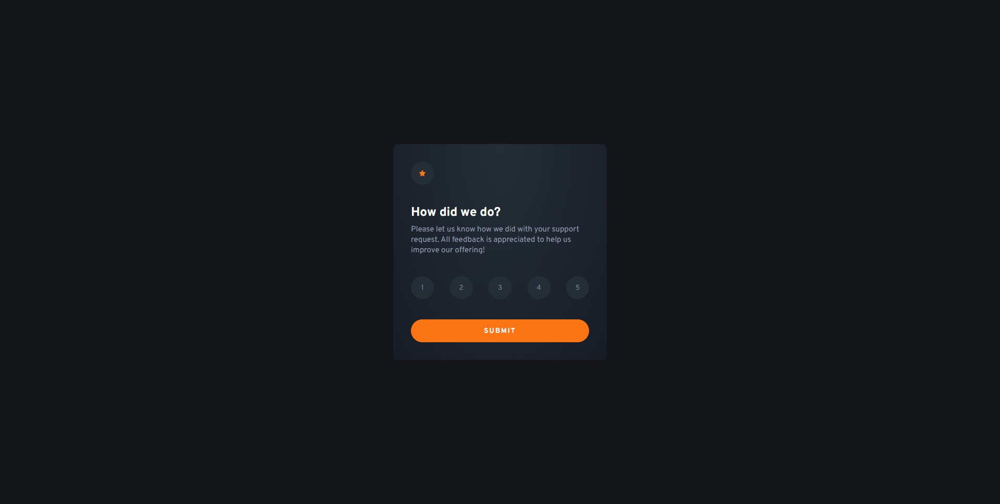

# Frontend Mentor - Interactive rating component solution

This is a solution to the [Interactive rating component challenge on Frontend Mentor](https://www.frontendmentor.io/challenges/interactive-rating-component-koxpeBUmI). Frontend Mentor challenges help you improve your coding skills by building realistic projects.

## Table of contents

- [Overview](#overview)
  - [The challenge](#the-challenge)
  - [Screenshot](#screenshot)
  - [Links](#links)
- [My process](#my-process)
  - [Built with](#built-with)
  - [What I learned](#what-i-learned)
  - [Continued development](#continued-development)
  - [Useful resources](#useful-resources)
- [Author](#author)

**Note: Delete this note and update the table of contents based on what sections you keep.**

## Overview

### The challenge

Users should be able to:

- View the optimal layout for the app depending on their device's screen size
- See hover states for all interactive elements on the page
- Select and submit a number rating
- See the "Thank you" card state after submitting a rating

### Screenshot

### Links

- Solution URL: [https://github.com/theadg/interactive-rating-component]
- Live Site URL: [https://theadg.github.io/interactive-rating-component/]

## My process

### Built with

- Semantic HTML5 markup
- CSS custom properties
- Flexbox
- CSS Grid
- Vanilla JS
- IIFE

### What I learned

I have learned how to use a **radial gradient**, which is basically a gradient but it's circular. I also got to know about the positioning of the said gradient. Also, I used an IIFE to code the JS section of the challenge for me to get used to using it. It's extremely helpful in reasons like you'll have cleaner, more organized code, adds maintainability to your code because you'll easily find what you need to find in the right spot.

### Continued development

I would love to get more comfortable with using IIFE's as well as look for a JS naming convention to make my code not so all over the place. I would like to use more gradients either linear or radial, in my projects because I believe they add more flavor in contrast to a plain color.

### Useful resources

- [IIFE](https://www.tutorialsteacher.com/javascript/immediately-invoked-function-expression-iife) - This helped me understand IIFE's more.
- [CSS Gradient Generator](https://cssgradient.io/) - I used this website to generate my radial gradient for the cards background. It saved me the hassle of trying out colors manually. This is a 100% recommend.

## Author

- Frontend Mentor - [theadg](https://www.frontendmentor.io/profile/theadg)
